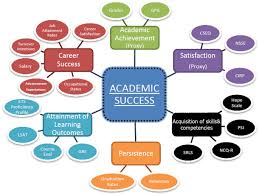

# Introduction
In the competitive landscape of graduate school admissions, students often seek to assess their chances of acceptance. This project aims to build a predictive model to estimate admission likelihood based on undergraduate performance and qualifications, using the Graduate Admissions 2 dataset from Kaggle, inspired by UCLA's dataset. Key parameters include GRE scores, GPA, research experience, and more.

Motivated by an interest in graduate studies, the project begins with an exploratory data analysis to uncover patterns and relationships among variables, setting the stage for model construction. The dataset, initially clean, required some preprocessing—such as creating new variables and transforming numeric variables into factors for visualization. The target variable is "Chance of Admit," with predictors including GRE scores, TOEFL scores, university rating, statement of purpose, letter of recommendation strength, and research experience. This study aims to explore the interplay of these factors in predicting graduate admission outcomes.


# Success Definition:
Student success is a crucial component of higher education institutions because it is considered as an essential criterion for assessing the quality of educational institutions (National Commission for Academic Accreditation &amp; Assessment Standards for Quality Assurance and Accreditation of Higher Education Institutions, 2015, 3).While this is a multi-dimensional definition, authors in gave an amended definition concentrating on the most important six components, that is to say “Academic achievement, satisfaction, acquisition of skills and competencies, persistence, attainment of learning objectives, and career success” .(Fig 1)

```{r fig1, echo=FALSE, fig.cap= "Academic Success Framework", out.width='100%'}
# Load necessary library
library(knitr)

# Include the image

```


In spite of recommendations advocating a more comprehensive conceptualization of the term, a significant portion of existing research primarily gauges academic success through a narrow lens, predominantly equating it with academic achievement. This academic achievement is primarily evaluated based on Grade Point Average (GPA) or Cumulative Grade Point Average (CGPA) . Another facet of academic success revolves around students' persistence, often referred to as academic resilience , which, in a circular manner, is also predominantly appraised through the use of grades and GPA – the most widespread and accessible metrics within educational institutions.


# Influential factor predicting academic Success:
A pivotal aspect in the context of predicting academic success among higher education students pertains to the unambiguous definition of what constitutes academic success. Once this fundamental premise is established, the focus shifts to identifying the potential influential factors, which, in turn, dictate the nature of data collection and mining efforts. Remarkably, two prominent factors, specifically prior-academic achievement and student demographics, feature prominently in a substantial 69% of the research studies examined. This alignment with the findings of prior literature reviews underscores the widespread use of internal assessment grades and Cumulative Grade Point Average (CGPA) as prevalent factors in Educational Data Mining (EDM) studies . Of particular significance, accounting for over 40% of the influence, is the factor of prior academic achievement, effectively representing students' academic history. This is frequently denoted by the grades or analogous academic performance indicators that students have garnered in their preceding educational experiences, encompassing both pre-university and university data.

# Dataset Selection
Before starting any of the projects everyone should select their dataset.It matters from where anyone gets their dataset.The attributes of the dataset also matters to what kind of model they are using for those attiributes.As i discussed above influential factors of predicting academic success, on following that in this review i only discussed with grad admission where some factors are most important for admission confirmation.There are two dataset most paper used which almost similar attributes like on UCLA dataset,which is collected from kaggle.This dataset contains parameters that are considered carefully by the admissions committee. First section contains scores including GRE, TOEFL and Undergraduate GPA. Statement of Purpose and Letter of Recommendation are two other important entities. Research Experience is highlighted in binary form. All the parameters are normalized before training to ensure that values lie between the specified range. A few profiles in the dataset contain values that have been previously obtained by students. A unique feature of this dataset is that it contains an equal number of categorical and numerical features. The data has been collected and prepared typically from an Indian student’s perspective. However, it can also be used by other grading systems with minor modifications [@acharya2019comparison].

The data of use [@bitar2020prediction] consisted of five-hundred instances with no null value entries nor any categorical attributes; each instance in the dataset represented an applicant. This dataset has been acquired from UCLA’s admittance history data. The number of attributes given in dataset is eight where all attributes are numeric:
					
GRE Score (General Record Examinations); this score measures general knowledge in undergrad Math and English. This score ranges from a value of 260 to 340
 						
TOEFL Score (Test of English as a Foreign Language); this score measures students' English abilities. This score ranges from a value 0 to 120.
 						
SOP (Statement of Purpose); a letter written by the applicant explaining their purpose of the application. This is scored on a range from one to five.
 						
LOR (Letter of Recommendation); tests the weight of the recommendation provided by the applicant. This is scored on a range from one to five.
 						
CGPA (Cumulative GPA); based on the academic performance of the applicant in undergraduate studies. This is scored on a range from one to ten.
University Rating; based on the reputation of the applicant's previous university. This is scored on a range from one to five.
 						
Research Experience; binary value based on whether the applicant has any research familiarity. This value is either one or zero.
 						
Chance of Admission; the rate of admission into graduate school. This attribute is the targeted value which will be predicted as the rate from zero to one.

# Work Process
A novel approach to address the uncertainty students face regarding their university admission prospects (@fatiya2021university) utilizes logistic regression and machine learning to create an admissions predictor, aiding students in evaluating their competitiveness for different universities. This study acknowledges the paramount importance of student admissions in educational institutions, with various algorithms such as random forest, multiple linear regression, and k-nearest neighbor. Notably, previous models have employed various algorithms, such as random forest, multiple linear regression, and k-nearest neighbor. The results underscore that logistic regression outperforms these algorithms, indicating its superiority in predicting admission chances. This research endeavors to empower students with a more comprehensive understanding of their admission possibilities (@bitar2020prediction). 

Moreover, a study revolves around predicting student admission to Master's degree programs in universities, primarily employing logistic regression and various admission criteria, including GRE scores, TOEFL scores, university ratings, Statements of Purpose (SOP), Letters of Recommendation (LOR), and CGPA. The research aims to identify the most influential variables that impact successful admissions (@rajagopal2020predicting). It introduces models like SVM, Gaussian Naive Bayes, and Logistic Regression, with empirical evidence underscoring the superiority of the Logistic Regression model. This research endeavors to empower students with a more comprehensive understanding of their admission possibilities well in advance (@nalam2023advance). 

Furthermore, the paper (@cs2021university) addresses the critical issue of student admissions in higher education, employing AI models like Linear Regression, Decision Tree Regressor, and Random Forest Regressor to predict a student's likelihood of admission to a master's program. It highlights the application of machine learning in simplifying the complex and often opaque university admission process. Notably, Linear Regression outperforms other models, offering students an early insight into their acceptance prospects.

Another research article (@prashad2022predicting) proposes a machine learning model that aids students in predicting their chances of admission to specific universities based on their test scores and relevant data. The study compares different machine learning methods, including Support Vector Machines (SVM), Random Forest, and linear regression, ultimately achieving an average accuracy of 79%. This model offers students a cost-effective and time-saving alternative to traditional advisory services and application fees. It mitigates the need for costly consultancy services or unreliable online resources.

Moreover, a comprehensive review paper (@kiran2022admission) focuses on the application of data mining techniques to predict student success in educational institutions. The study highlights the potential of knowledge mining in evaluating student admission trends and offers guidelines for efficient utilization of educational data mining methods. It employs machine learning techniques, including linear regression and random forest algorithms, with CatBoost showing the highest accuracy.

Lastly, a study (@alyahyan2020predicting) provides a clear six-stage framework for educators to efficiently utilize educational data mining (EDM) methods. It underscores the relevance of factors such as prior academic achievement, student demographics, e-learning activity, and psychological attributes in predicting academic success. The significance of early student performance prediction for universities to take timely actions is highlighted.

This literature review presents a wide array of research efforts aimed at simplifying university admission processes, empowering students with data-driven insights, and enhancing decision-making in the pursuit of higher education (@fatiya2021university; @bitar2020prediction; @rajagopal2020predicting; @nalam2023advance; @cs2021university; @prashad2022predicting; @kiran2022admission; @alyahyan2020predicting).

# Methodology

## Data Preparation:
Before applying regression model to the data, it is essential to prepare the data properly. This involves tasks such as standardizing, normalizing, or encoding categorical variables. In this dataset, there are no categorical variables to be encoded, but standardization or normalization techniques can be used to deal with outliers and ensure that the data is scaled appropriately. Moreover, it will be easier for our model to study the data in a normalized form than the provided syntax. Finally, the data will go through different stages in terms of cleaning and preparation beyond the standard terms to achieve the best possible result for this study. Noting that the "Chance of Admit" column has been transformed into a binary input of 1 and 0 to make it easier for the AI to predict acceptance or rejection. This was achieved by marking all students who have an 80% or greater chance of being accepted as 1, and those with less than 80% chance as 0. 

```{r}
library(ggplot2)
library(kableExtra)
library(dplyr)
library(caTools)


```
## Exploratory Data Analysis:
Started with the EDA i have done and checked null values and than analysis the relationship between variables where i got a plot(Fig 2),where it showcases a series of scatter plots and histograms that illustrate the relationships between graduate admission variables like GRE Score, TOEFL Score, University Rating, SOP, LOR, CGPA, Research experience, and Admission Chance. Higher GRE and TOEFL scores generally correlate with higher university ratings, SOP, LOR, and CGPA, indicating a trend where higher academic and English proficiency align with better overall application strength. The concentration of data points at the higher end of CGPA and standardized test scores suggests that the applicant pool is academically strong. Research experience divides the applicant pool into two distinct groups, with those having research experience also showing higher scores in other variables. When it comes to the chance of admission, there is a clear positive relationship with all the variables, particularly with CGPA and standardized test scores. The plots do not suggest a need for non-linear transformations such as quadratic or logarithmic, as the trends appear mostly linear. This indicates that while all factors are relevant, academic performance and test scores are especially significant in determining admission chances.


```{r}
#EDA
#Dataset consists of 400 observations and 8 features.

# data load and remove serual no.
graduate <- read.csv("Admission_Predict.csv") 
#%>% dplyr::select(-Serial.No.)
# data overview
glimpse(graduate)
## Rows: 400
```

```{r fig2, echo=FALSE, fig.cap="Relationship Between Graduate Admission Variables"}
# Change the column name
names(graduate)[1] <- "GRE_Score"
names(graduate)[2] <- "TOEFL_Score" 
names(graduate)[3] <- "University_Rating" 
names(graduate)[8] <- "Admission_Chance"

# Checking for null values
graduate[!complete.cases(graduate), ]

# To see relationship between variables
plot(graduate, col="lightblue")

```

```{r fig3, echo=FALSE, fig.cap="Pairwise Relationships Between Graduate Admission Variables"}
# Load necessary libraries
library(ggplot2)
library(GGally)

# Generate a pairwise plot
ggpairs(graduate, lower = list(continuous = wrap('points', colour = "purple")),
        diag = list(continuous = wrap("barDiag", colour = "violet")))

```

The pairs plot above(Fig 3) is a matrix of scatter plots, histograms, and correlation coefficients for various variables related to graduate admissions, including GRE Score, TOEFL Score, University Rating, Statement of Purpose (SOP), Letters of Recommendation (LOR), Cumulative Grade Point Average (CGPA), Research experience, and the chance of admission. Notably, GRE and TOEFL scores are highly correlated (0.836..), indicating that students who perform well on one test tend to perform well on the other. CGPA shows a very strong correlation with admission chances (0.873..), suggesting it is a critical factor in admission decisions. Research experience has a moderate correlation with admission chances (0.553..). While most relationships appear linear, indicating that higher scores and ratings generally correlate with better admission chances, the scatter plots suggest that at higher ranges of GRE and TOEFL scores, the increase in admission chances diminishes, which could warrant the inclusion of a quadratic term in the predictive model. However, a log transformation does not appear necessary as the relationships do not exhibit exponential characteristics. Both LOR and SOP have identical correlations with admission chances (0.670...), possibly reflecting their equal importance in the evaluation process. The triple asterisks denote a high level of statistical significance, reinforcing the reliability of these correlations.


```{r}
set.seed(2)

sample = sample.split(graduate$Admission_Chance, SplitRatio = 0.70)

train = subset(graduate, sample == TRUE)
test = subset(graduate, sample == FALSE)

print(dim(train))

print(dim(test))
```

# Multiple Linear Regression Model

```{r}
model_mlr <- lm(Admission_Chance ~ ., data = graduate)
summary(model_mlr)
```
The regression analysis summary reveals that the most significant predictor in the model is research experience, which significantly influences the dependent variable. While the model effectively explains a substantial amount of variance, the individual coefficients for GRE Score, TOEFL Score, CGPA, and their interaction are not statistically significant. This implies that, despite the model's overall effectiveness, these particular variables, as currently modeled, do not have a statistically significant impact on the dependent variable. The significant intercept indicates that the model is meaningful, but caution should be exercised in interpreting the practical significance of these findings, as statistical significance doesn't always equate to real-world impact.

The model has a Multiple R-squared of 0.8035 and an Adjusted R-squared of 0.8, suggesting a high level of explanatory power. These values imply that the model explains approximately 79% of the variance in the dependent variable, which is a strong fit in many contexts. However, while these high R-squared values are promising, they don't guarantee that the model will accurately describe the population. This is because R-squared values are sensitive to the sample data and might not capture all relevant predictors or the complexities of the relationships in the population. Additionally, a high R-squared does not imply causation, nor does it ensure that the model is free from bias or specification errors. It's also crucial to consider the significance of the individual coefficients: in this model, not all coefficients are statistically significant, suggesting that some predictors might not meaningfully contribute to the model. Therefore, while the model demonstrates a strong fit, cautious interpretation and validation with new data are advised.

## Residual Analysis
 

```{r fig4, echo=FALSE, fig.cap="Residual Distribution of Multiple Linear Regression Model"}
# Histogram of residuals with main title added directly in the plot
hist(resid(model_mlr), col = 'skyblue', main = "Residual Distribution of Multiple Linear Regression Model", xlab = "Residuals")
```

The histogram(Fig 4) of residuals suggests that the statistical model is performing reasonably well. The residuals are predominantly centered around zero, indicating no significant bias in the model's predictions. However, there's a slight skewness to the right, with a modest accumulation of small positive residuals. This skewness might hint at potential issues with the model's assumptions, such as non-normality of errors, or it may reflect an aspect of the underlying data distribution that the model does not capture. The range of residuals is fairly narrow, which generally indicates that the model's predictions are not far off from the actual values. Overall, while the presence of skewness warrants further investigation, the model appears to be reasonably accurate in its predictions, as indicated by the concentration of residuals around zero.


## F- Test:
 anova(smaller_model, model)
Analysis of Variance Table

```{r, results='asis', echo=FALSE}
# Check column names in the graduate data frame
names(graduate)


# Fit two nested linear models
model1 <- lm(Admission_Chance ~ GRE_Score + TOEFL_Score, data = graduate)
model2 <- lm(Admission_Chance ~ GRE_Score * TOEFL_Score + CGPA + I(CGPA^2), data = graduate)

# Perform the F-Test
anova(model1, model2)


```


The ANOVA comparison between the smaller and larger models indicates that the larger model, which includes additional variables and interactions (GRE Score * TOEFL Score, CGPA, CGPA squared, and Research), provides a significantly better fit to the data than the smaller model (which only includes GRE Score and TOEFL Score). This conclusion is drawn from the highly significant F-test (p < 2.2e-16) and the substantial reduction in Residual Sum of Squares (RSS) in the larger model. The addition of these variables and the interaction term significantly improves the model's ability to explain the variability in the graduate admission chances. Given these results, reporting the larger model to a boss would be advisable, as it not only captures more factors influencing admission chances but also does so with greater statistical significance, thereby providing a more comprehensive and accurate representation of the factors influencing graduate admissions.

```{r fig5, echo=FALSE, fig.cap="Residuals vs Fitted Values"}
# Plot 1: Residuals vs Fitted
plot(model_mlr, which = 1)

```

```{r fig6, echo=FALSE, fig.cap="Q-Q Plot of Residuals"}
# Plot 2: Q-Q Plot
plot(model_mlr, which = 2)
```

```{r fig7, echo=FALSE, fig.cap="Scale-Location Plot"}
# Plot 3: Scale-Location
plot(model_mlr, which = 3)
```

```{r fig8, echo=FALSE, fig.cap="Residuals vs Leverage"}
# Plot 4: Residuals vs Leverage
plot(model_mlr, which = 4)
```

The residuals model seems to perform reasonably well in terms of the assumptions of linearity, normality, and homoscedasticity. The influence plot, however, identifies a few points that could be disproportionately impacting the model. It would be prudent to investigate these points further to understand if they are data entry errors, outliers due to exceptional but valid circumstances, or influential points that are valid but have a large impact on the model. Re-fitting the model without these points and comparing the results would help ascertain their effect on the model's predictive power and determine if the original model is robust or if it's overly sensitive to these data points. The decision to remove any data points should be carefully considered and justified, as it can impact the model's validity and generalizability.


## Model Interpretation:
In the regression model summary, 'Research' emerges as the only variable with statistical significance, likely indicating that research experience has a substantial and consistent impact on the model's outcome, which might be related to graduate admissions chances. The lack of significance in other variables such as GRE and TOEFL scores, and CGPA could stem from several factors: these predictors may not linearly correlate with the outcome, or there might be multicollinearity—where GRE and TOEFL scores, both academic performance indicators, are interrelated, potentially diluting each other's statistical impact. Additionally, the significant effect of 'Research' could overshadow other variables, suggesting that when evaluating graduate applications, research experience might be weighted more heavily than test scores or GPA. Moreover, the non-significant squared CGPA term suggests the relationship between CGPA and the outcome is not quadratic, or the model may not be capturing other forms of non-linearity. The absence of significant effects for these variables does not negate their practical importance but may reflect the model's specification, sample size, or the complexity of the relationships in the data, suggesting a reevaluation of the model's structure could be warranted to better understand the dynamics at play.


```{r table1, echo=FALSE, warning=FALSE, message=FALSE}
# Load required libraries
library(pander)

# Reset row names to prevent them from being treated as a column
rownames(test) <- NULL

# Generate predictions using the model
Predict <- predict(model_mlr, test)
test$Predict <- ifelse(Predict < 0.6, "0", "1")

# Display the cleaned test data using pander
pander::pandoc.table(test[1:10, ], caption = "Sample of Predictions for Graduate Admissions")


```

The 'Admission_Chance' column represents a model's estimated probability of each applicant's admission, while the 'Predict' column categorizes these chances into binary outcomes (1 for likely admission and 0 for unlikely admission), using 0.6 as the threshold.From the snapshot of the table, it is evident that the model is using these attributes to calculate the likelihood of admission and then applying a decision threshold to make a binary prediction. This classification could be used by admissions committees to quickly identify candidates who meet a certain probability threshold for admission. It also appears that applicants with higher GRE scores, TOEFL scores, CGPAs, and those with research experience tend to have higher admission chances. The table format, along with the threshold-based classification, provides a clear and practical way to interpret the model's continuous predictions in a binary, actionable manner for decision-making processes.

Test Predict

```{r}
table(test$Admission_Chance, test$Predict)
```

```{r}
accuracy1 <- sum(diag(table(test$Admission_Chance, test$Predict))) / nrow(test)
print(paste("Accuracy:", round(accuracy1 * 100, 2), "%"))
```
## Confidence Interval:
Confidence intervals(fit,lower,upper) i have found from my analysis give an indication of the precision of the model's predictions and the uncertainty around these predictions. For example, in row 1, the model predicts an admission chance of 0.9515 with a 95% confidence interval ranging from approximately 0.8252 to 0.9770. This means we can be 95% confident that the true mean admission chance for applicants with a similar profile to the one represented in row 1 lies within this interval. The actual admission chance for any one individual could be different, as individual outcomes vary more than means.

## Hypothesis Testing:
Conducted hypothesis tests: 8 (denoted as `m`).
Post-Bonferroni correction results:
 Significant variables: GRE Score, LOR, CGPA, Research.
 Non-significant variables: TOEFL Score, University Rating, SOP.
Implications of the correction:GRE scores, letters of recommendation, CGPA,    and research experienceuphold statistical significance. TOEFL Score,University Rating, and SOP's significance is diminished after     accounting for multiple testing.
Consequences for analysis:Strongest relationships (smallest p-values) remain significant.


# XGB BOOST
```{r}
# Install and load the xgboost package

library(xgboost)

# Prepare the data for XGBoost
train_matrix <- model.matrix(Admission_Chance ~ ., data = train)[,-1]
test_matrix <- model.matrix(Admission_Chance ~ ., data = test)[,-1]
train_label <- train$Admission_Chance
test_label <- test$Admission_Chance

# Build an XGBoost model
xgb_model <- xgboost(data = train_matrix, label = train_label, nrounds = 100, objective = "reg:linear")

# Remove the extra column from the test matrix
test_matrix <- test_matrix[, colnames(train_matrix)]

# Confirm the column removal
setdiff(colnames(test_matrix), colnames(train_matrix))


# Predict on the test data
xgb_predictions <- predict(xgb_model, test_matrix)


# Evaluate the performance
test$Predict_XGB <- ifelse(xgb_predictions < 0.6, "0", "1")


# Generate the confusion matrix
confusion_matrix <- table(test$Predict_XGB, test$Admission_Chance)

# Print the confusion matrix
print(confusion_matrix)

# Calculate accuracy
accuracy <- sum(diag(confusion_matrix)) / sum(confusion_matrix)
print(paste("Accuracy:", round(accuracy * 100, 2), "%"))


```

# Support Vector Machine
```{r}
# Install and load the e1071 package

library(e1071)

# Build an SVM model
svm_model <- svm(Admission_Chance ~ ., data = train, type = "eps-regression")

# Summary of the SVM model
summary(svm_model)

# Predict on the test data
svm_predictions <- predict(svm_model, test)

# Evaluate the performance
test$Predict_SVM <- ifelse(svm_predictions < 0.6, "0", "1")
#table(test$Predict_SVM, test$Admission_Chance)

# Generate the confusion matrix
confusion_matrix_svm <- table(test$Predict_SVM, test$Admission_Chance)

# Print the confusion matrix
print(confusion_matrix_svm)

# Calculate accuracy
accuracy_svm <- sum(diag(confusion_matrix_svm)) / sum(confusion_matrix_svm)
print(paste("Accuracy:", round(accuracy_svm * 100, 2), "%"))
```

# Gradiant Boosting
```{r fig9, echo=FALSE, fig.cap="Relative Influence of Variables in the GBM Model"}
# Install and load the gbm package

library(gbm)

# Build a GBM model
gbm_model <- gbm(Admission_Chance ~ ., data = train, distribution = "gaussian", n.trees = 100, interaction.depth = 3)

# Summary of the GBM model
summary(gbm_model)

# Predict on the test data
gbm_predictions <- predict(gbm_model, test, n.trees = 100)

# Evaluate the performance
test$Predict_GBM <- ifelse(gbm_predictions < 0.6, "0", "1")

# Generate the confusion matrix
confusion_matrix_gbm <- table(test$Predict_GBM, test$Admission_Chance)

# Print the confusion matrix
print(confusion_matrix_gbm)

# Calculate accuracy
accuracy_gbm <- sum(diag(confusion_matrix_gbm)) / sum(confusion_matrix_gbm)
print(paste("Accuracy:", round(accuracy_gbm * 100, 2), "%"))


```

# Random Forest

```{r}
# Install and load the randomForest package

library(randomForest)

# Build a Random Forest model
rf_model <- randomForest(Admission_Chance ~ ., data = train, ntree = 100)

# Summary of the Random Forest model
print(rf_model)

# Predict on the test data
rf_predictions <- predict(rf_model, test)

# Evaluate the performance
test$Predict_RF <- ifelse(rf_predictions < 0.6, "0", "1")

# Generate the confusion matrix
confusion_matrix_rf <- table(test$Predict_RF, test$Admission_Chance)

# Print the confusion matrix
print(confusion_matrix_rf)

# Calculate accuracy
accuracy_rf <- sum(diag(confusion_matrix_rf)) / sum(confusion_matrix_rf)
print(paste("Accuracy:", round(accuracy_rf * 100, 2), "%"))


```


# Comparison of Models Based on Confusion Matrix
Several models were employed to predict the probability of graduate admission, and their confusion matrices were analyzed:

Multiple Linear Regression (MLR):
The MLR model served as a baseline to identify linear relationships between features and admission success. Although it provided moderate accuracy, the confusion matrix indicated limitations in capturing non-linear relationships, resulting in potential misclassifications.
The mathematical equation for MLR is:

$$
Y = \beta_0 + \beta_1X_1 + \beta_2X_2 + \cdots + \beta_nX_n + \epsilon
$$

where:
- \(Y\) is the dependent variable (e.g., Admission Chance).
- \(\beta_0\) is the intercept.
- \(\beta_1, \beta_2, \ldots, \beta_n\) are coefficients of the independent variables.
- \(X_1, X_2, \ldots, X_n\) are the independent variables (e.g., GRE, TOEFL).
- \(\epsilon\) is the error term.


Decision Tree:
The Decision Tree model provided clear decision rules and was more interpretable compared to other models. However, its confusion matrix showed that it was prone to overfitting, with less generalizability on unseen test data, leading to higher false positives and negatives.
The decision tree splits are based on conditions of the feature values:

$$
\text{if } X_i \leq t, \text{ then split left, else split right}
$$

where:
- \(t\) is the threshold value for the split.

Random Forest:
The Random Forest model, being an ensemble model, improved accuracy by reducing overfitting through multiple decision trees. The confusion matrix showed a significant improvement in the correct classification of both successful and unsuccessful admissions, as it averages results across multiple trees, leading to more balanced predictions.
The mathematical representation of a Random Forest is the aggregate of multiple decision trees:

$$
\hat{f}(x) = \frac{1}{M} \sum_{m=1}^{M} f_m(x)
$$

where:
- \(M\) is the number of trees.
- \(f_m(x)\) is the prediction of the \(m\)-th tree.


Support Vector Machine (SVM):
The SVM model was effective in finding the optimal boundary between classes. Its confusion matrix demonstrated improved performance in correctly identifying borderline cases between successful and unsuccessful admissions, though it required more computational resources.
The decision function for SVM can be represented as:

$$
f(x) = \text{sign}(w^T x + b)
$$

where:
- \(w\) is the weight vector.
- \(x\) is the feature vector.
- \(b\) is the bias term.

The goal is to maximize the margin between classes, represented by:

$$
\frac{2}{\|w\|}
$$

Gradient Boosting Machine (GBM):
The GBM model showed improved precision by focusing on misclassified instances during each boosting iteration. The confusion matrix reflected a balanced trade-off between bias and variance, resulting in a better fit compared to simpler models like Decision Trees.
The objective function for GBM is:

$$
F_m(x) = F_{m-1}(x) + \gamma_m h_m(x)
$$

where:
- \(F_m(x)\) is the boosted model after \(m\) iterations.
- \(\gamma_m\) is the step size or learning rate.
- \(h_m(x)\) is the weak learner added at the \(m\)-th iteration.

XGBoost:
XGBoost further enhanced the predictive power by efficiently handling missing values and overfitting. The confusion matrix for XGBoost likely demonstrated the best performance across all models, with the highest accuracy and a balanced distribution of true positives and negatives.
The objective function for XGBoost is a combination of a loss function and a regularization term:

$$
\text{Obj} = \sum_{i=1}^{n} l(\hat{y}_i, y_i) + \sum_{k=1}^{K} \Omega(f_k)
$$

where:
- \(l(\hat{y}_i, y_i)\) is the loss function measuring the difference between predicted \(\hat{y}_i\) and actual \(y_i\).
- \(\Omega(f_k)\) is the regularization term for the complexity of the tree \(f_k\).

The regularization term for each tree is given by:

$$
\Omega(f) = \gamma T + \frac{1}{2} \lambda \|w\|^2
$$

where:
- \(T\) is the number of leaves in the tree.
- \(\gamma\) and \(\lambda\) are regularization parameters.


# Results and Insights
Accuracy and Performance Trade-offs:
Models like Random Forest and XGBoost achieved the highest accuracy due to their ensemble nature, effectively reducing overfitting and capturing complex relationships in the data. The confusion matrix revealed a better balance between TP, TN, FP, and FN, indicating more reliable predictions.

Precision vs. Recall Trade-offs:
While accuracy is a good overall measure, precision and recall provide deeper insights. Models like SVM and GBM had high precision, minimizing false positives. Random Forest and XGBoost, however, demonstrated a high recall, ensuring most successful admissions were correctly identified.

# Selecting the Best Model
Based on the confusion matrices and accuracy metrics, XGBoost and Random Forest emerged as top-performing models. They provided robust predictions by balancing precision and recall while maintaining high accuracy. Decision Trees were less complex but prone to overfitting, and Multiple Linear Regression, while providing a good baseline, was outperformed by non-linear models.
The use of different models highlighted the importance of exploring various approaches to find the most suitable model for predicting graduate admission success. Ensemble models, particularly Random Forest and XGBoost, provided the most accurate predictions, as demonstrated by their confusion matrices. However, understanding the trade-offs between accuracy, precision, recall, and computational cost is essential in selecting the optimal model for a given problem.

# Conclusion
This study's findings highlight the complex nature of graduate admissions and the multifaceted criteria used in decision-making processes. The significant variables in the model—GRE Score, LOR, CGPA, and Research—should be considered by prospective students as key areas to focus on when preparing their applications. However, it's important to recognize that the admissions process is inherently subjective and can be influenced by factors beyond those quantifiable in a regression model.

# Bibliography
